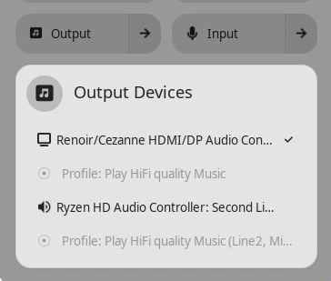
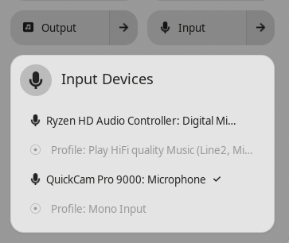

# Quick Sound Switcher

GNOME Shell extension that adds audio device selection to the Quick Settings panel. Switch output/input devices, change audio profiles, and control per-application volume — all from the system menu.

Based on [Sound Input & Output Device Chooser](https://github.com/kgshank/gse-sound-output-device-chooser) by Gopi Sankar Karmegam, rewritten from scratch for GNOME 45-50 using modern ESM modules and the QuickSettings API.

## Screenshots

| Output Devices | Input Devices |
|:---:|:---:|
|  |  |

## Features

- **Output Device Chooser** — Quick Settings toggle menu listing all output devices (speakers, HDMI, Bluetooth, etc.)
- **Input Device Chooser** — Quick Settings toggle menu listing all input devices (microphones)
- **Audio Profile Switching** — Change device profiles (e.g., A2DP vs HSP/HFP for Bluetooth headsets)
- **Per-App Volume Mixer** — Control volume per application and route app audio to different outputs
- **Keyboard Shortcuts** — Cycle through devices with configurable hotkeys
- **Port Visibility** — Hide or always-show specific audio ports
- **Configurable Icons** — Monochrome, colored, or no icons

## Requirements

- GNOME Shell 45, 46, 47, 48, 49, or 50
- PulseAudio or PipeWire (with PulseAudio compatibility)
- Python 3 (optional, for improved port profile detection)

## Installation

### From Source

```bash
git clone https://github.com/dustin-hawkins/quick-sound-switcher.git
cd quick-sound-switcher
mkdir -p ~/.local/share/gnome-shell/extensions/quick-sound-switcher@dustin-hawkins
cp -r * ~/.local/share/gnome-shell/extensions/quick-sound-switcher@dustin-hawkins/
glib-compile-schemas ~/.local/share/gnome-shell/extensions/quick-sound-switcher@dustin-hawkins/schemas/
```

Then restart GNOME Shell (log out/in on Wayland, or `Alt+F2` → `r` on X11) and enable:

```bash
gnome-extensions enable quick-sound-switcher@dustin-hawkins
```

### From Zip Bundle

```bash
gnome-extensions install quick-sound-switcher@dustin-hawkins.shell-extension.zip
```

## Building a Release Bundle

To produce the `quick-sound-switcher@dustin-hawkins.shell-extension.zip` bundle for upload to [extensions.gnome.org](https://extensions.gnome.org/upload/), run:

```bash
./build.sh
```

The script:

1. Compiles the GSettings schemas (`schemas/*.gschema.xml`).
2. Strips `__pycache__` from `utils/` so transient artifacts don't ship.
3. Calls `gnome-extensions pack` with all extra sources the extension needs (extra JS modules, `utils/`, `icons/`) and `--podir=po` so translations are compiled into `.mo` files under the `quick-sound-switcher` gettext domain inside the bundle. Raw `.po` sources are never shipped.

Required tools: `gnome-extensions` (from `gnome-shell`), `glib-compile-schemas` (from `glib2`), and `gettext` (for `msgfmt`, used by `gnome-extensions pack` when compiling translations).

If you prefer to invoke `gnome-extensions pack` manually, the equivalent command is:

```bash
glib-compile-schemas schemas/
gnome-extensions pack \
    --force \
    --extra-source=deviceChooserBase.js \
    --extra-source=outputDeviceChooser.js \
    --extra-source=inputDeviceChooser.js \
    --extra-source=appMixer.js \
    --extra-source=portSettings.js \
    --extra-source=signalManager.js \
    --extra-source=utils/ \
    --extra-source=icons/ \
    --podir=po \
    --out-dir=.
```

The output filename embeds the current version, derived from `git describe --tags --always --dirty`:

- On a clean tagged commit (e.g. `v1.0.1`): `quick-sound-switcher@dustin-hawkins-v1.0.1.shell-extension.zip`
- Past the latest tag: `...-v1.0.1-3-gabc1234.shell-extension.zip`
- Working tree has uncommitted changes: suffix `-dirty`

To validate the produced bundle against [`shexli`](https://pypi.org/project/shexli/) (GNOME Shell extension static analysis), run:

```bash
./test.sh
```

After the bundle is built, upload it at <https://extensions.gnome.org/upload/>.

## Cutting a Release

Releases are tagged with semantic versions (e.g. `v1.0.1`) and published as
GitHub releases with the bundle attached. Tag first, build second, then
publish via `gh`:

```bash
# 1. Tag the release on a clean main, then push the tag
git tag -a v1.0.1 -m "Release v1.0.1"
git push origin v1.0.1

# 2. Build a bundle whose filename embeds the new tag, then validate
./build.sh
./test.sh

# 3. Create the GitHub release with the bundle attached
gh release create v1.0.1 \
    quick-sound-switcher@dustin-hawkins-v1.0.1.shell-extension.zip \
    --title "v1.0.1" \
    --notes "Release notes here…"

# 4. (Optional) Upload the same bundle to extensions.gnome.org
xdg-open https://extensions.gnome.org/upload/
```

To replace the bundle on an existing release without recreating the tag:

```bash
gh release upload v1.0.1 \
    quick-sound-switcher@dustin-hawkins-v1.0.1.shell-extension.zip --clobber
```

## Configuration

Open preferences via:

```bash
gnome-extensions prefs quick-sound-switcher@dustin-hawkins
```

### Settings

| Setting | Description | Default |
|---------|-------------|---------|
| Hide on Single Device | Hide chooser when only one device exists | Off |
| Icon Theme | Monochrome, Colored, or None | Monochrome |
| Show Audio Profiles | Display profile options per device | On |
| Show Output/Input Chooser | Enable each device type selector | On |
| Always Show Input Slider | Keep mic slider visible even when idle | On |
| Block Hidden Device Activation | Prevent auto-switching to hidden devices | On |
| Use Python for Profiles | More accurate profile detection via Python | On |

### Keyboard Shortcuts

| Action | Default Shortcut |
|--------|-----------------|
| Cycle Output Forward | `Super+Alt+Page Up` |
| Cycle Output Backward | `Super+Alt+Page Down` |
| Cycle Input Forward | `Super+Alt+Home` |
| Cycle Input Backward | `Super+Alt+End` |

Edit shortcuts via `dconf-editor` at `/org/gnome/shell/extensions/quick-sound-switcher/`.

## Credits

This project is a ground-up rewrite inspired by [Sound Input & Output Device Chooser](https://github.com/kgshank/gse-sound-output-device-chooser):

- Original concept and logic by [Gopi Sankar Karmegam](https://github.com/kgshank)
- Volume mixer based on work by [Brendan Early](https://github.com/mymindstorm/gnome-volume-mixer) and Burak Sener
- Rewritten for GNOME 45-50 by [Dustin Hawkins](https://github.com/dustin-hawkins)

## License

GPL-3.0-or-later. See [license](license) for details.
